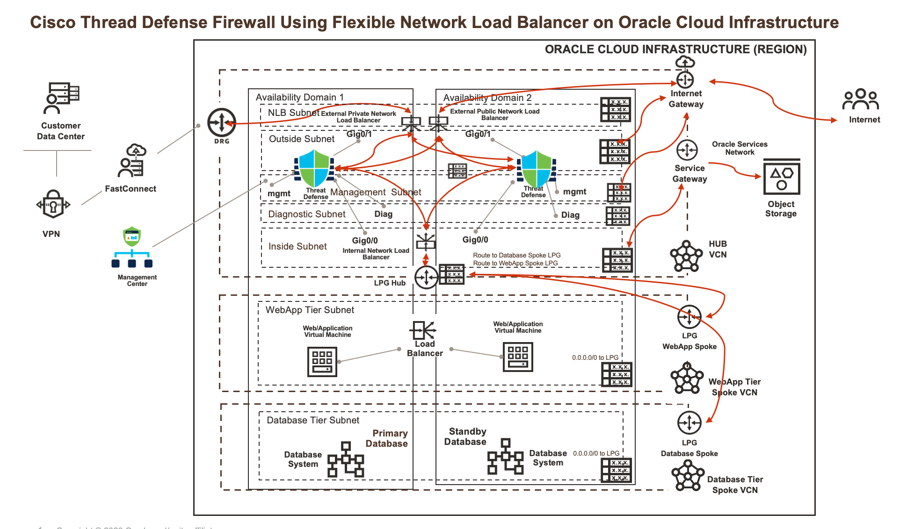
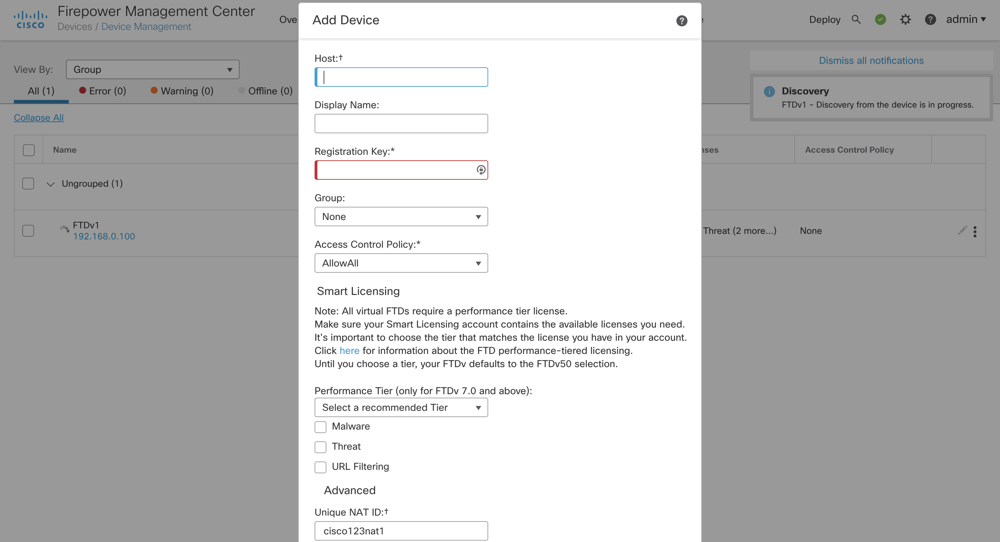
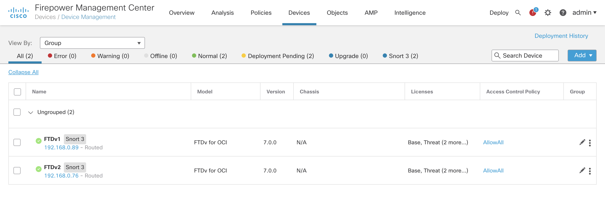
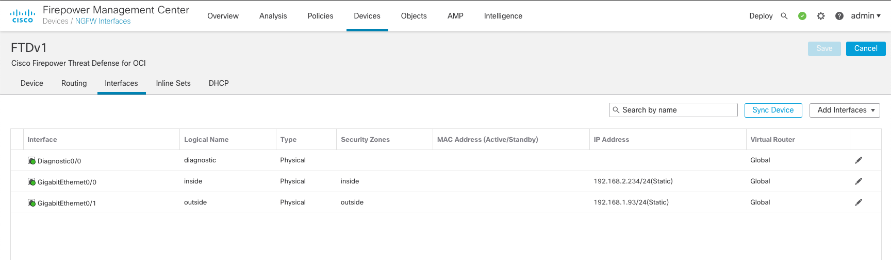
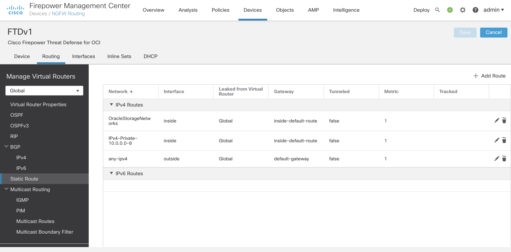
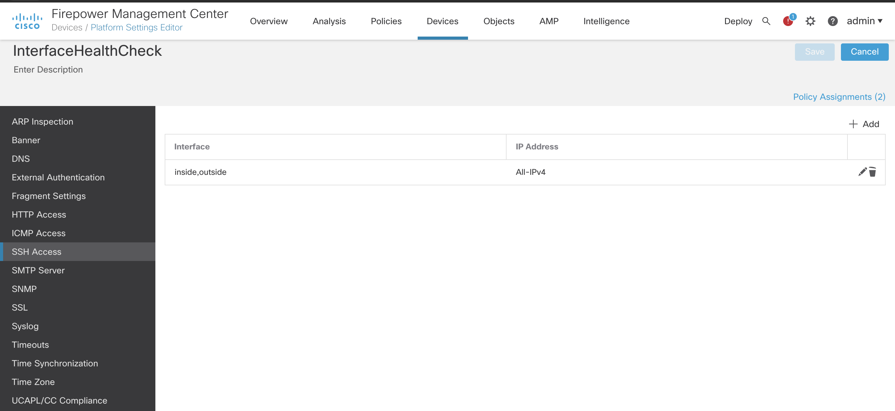
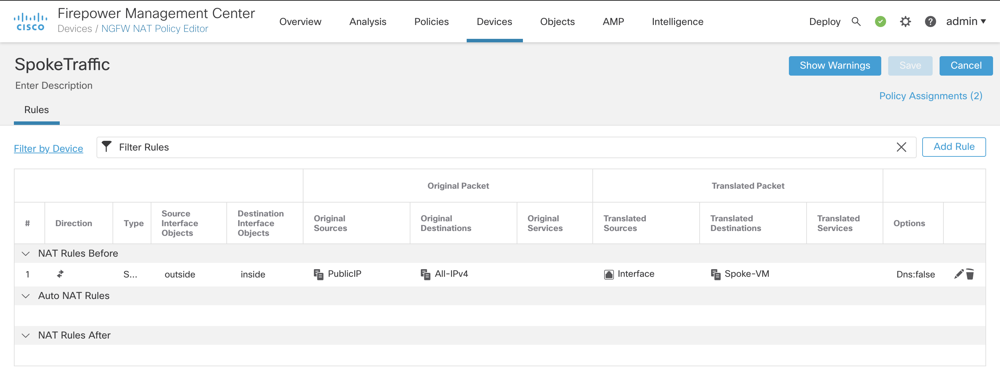

# Network Load Balancer Sandwich Topology - Reference Architecture

We are using hub-and-spoke architecture (often called as star topology) and flexible network load balancer with Cisco Thread Defense Firewall. This architecture has a central component (the hub) that's connected to multiple networks around it, like a spoke. We are using Cisco Threat Defence BOYL Listing from OCI Marketplace.

For details of the architecture, see [_Set up a hub-and-spoke network topology_](https://docs.oracle.com/en/solutions/hub-spoke-network/index.html).

## Architecture Diagram



## Validated Version Details

We have validated **7.0.0** Secure Threat Defense Firewall for this architecture.

## Prerequisites

You should complete below pre-requisites before proceeding to next section:
- You have an active Oracle Cloud Infrastructure Account.
  - Tenancy OCID, User OCID, Compartment OCID, Private and Public Keys are setup properly.
- Permission to `manage` the following types of resources in your Oracle Cloud Infrastructure tenancy: `vcns`, `internet-gateways`, `route-tables`, `security-lists`, `local-peering-gateways`, `subnets`, `network-load-balancers` and `instances`.
- Quota to create the following resources: 3 VCNS, 6 subnets, and 6 compute instance.

If you don't have the required permissions and quota, contact your tenancy administrator. See [Policy Reference](https://docs.cloud.oracle.com/en-us/iaas/Content/Identity/Reference/policyreference.htm), [Service Limits](https://docs.cloud.oracle.com/en-us/iaas/Content/General/Concepts/servicelimits.htm), [Compartment Quotas](https://docs.cloud.oracle.com/iaas/Content/General/Concepts/resourcequotas.htm).


## Deployment Options

You can deploy this architecture using two approach explained in each section: 
1. Using Oracle Resource Manager 
2. Using Terraform CLI 

## Deploy Using Oracle Resource Manager

In this section you will follow each steps given below to create this architecture:

1. Click [](https://console.us-phoenix-1.oraclecloud.com/resourcemanager/stacks/create?region=home&zipUrl=https://github.com/oracle-quickstart/oci-cisco/raw/master/ftdv/nlb-use-case/resource-manager/cisco-nlb.zip)

    > If you aren't already signed in, when prompted, enter the tenancy and user credentials.

2. Review and accept the terms and conditions.

3. Select the region where you want to deploy the stack.

4. Follow the on-screen prompts and instructions to create the stack.

5. After creating the stack, click **Terraform Actions**, and select **Plan** from the stack on OCI console UI.

6. Wait for the job to be completed, and review the plan.

    > To make any changes, return to the Stack Details page, click **Edit Stack**, and make the required changes. Then, run the **Plan** action again.

7. If no further changes are necessary, return to the Stack Details page, click **Terraform Actions**, and select **Apply**. 

8. At this stage your architecture should have been deployed successfully. You can proceed to next section for configuring your Cisco VM Series Firewall.

9. If you no longer require your infrastructure, return to the Stack Details page and **Terraform Actions**, and select **Destroy**.


## Deploy Using the Terraform CLI

In this section you will use **Terraform** locally to create this architecture: 


1. Create a local copy of this repo using below command on your terminal: 

    ```
    git clone https://github.com/oracle-quickstart/oci-cisco.git
    cd oci-cisco/nlb-use-case/
    ls
    ```

2. Complete the prerequisites described [here] which are associated to install **Terraform** locally:(https://github.com/oracle-quickstart/oci-prerequisites#install-terraform).
    Make sure you have terraform v0.13+ cli installed and accessible from your terminal.

    ```bash
    terraform -v

    Terraform v0.13.0
    + provider.oci v4.14.0
    ```

3. Create a `terraform.tfvars` file in your **nlb-use-case** directory, and specify the following variables:

    ```
    # Authentication
    tenancy_ocid         = "<tenancy_ocid>"
    user_ocid            = "<user_ocid>"
    fingerprint          = "<finger_print>"
    private_key_path     = "<pem_private_key_pem_file_path>"

    # SSH Keys
    ssh_public_key  = "<public_ssh_key_string_value>"

    # Region
    region = "<oci_region>"

    # Compartment
    compute_compartment_ocid = "<compartment_ocid>"
    network_compartment_ocid = "<network_compartment_ocid>"
    availability_domain_number = "<availability_domain_number>

    ````

4. Create the Resources using the following commands:

    ```bash
    terraform init
    terraform plan
    terraform apply
    ```

5. At this stage your architecture should have been deployed successfully. You can proceed to next section for configuring your Cisco VM Series Firewall. 

6. If you no longer require your infrastructure, you can run this command to destroy the resources:

    ```bash
    terraform destroy
    ```

## Cisco Components Configuration 

You can follow [official guide](https://www.cisco.com/c/en/us/td/docs/security/firepower/quick_start/oci/ftdv-oci-gsg.pdf) to setup your FMC (Firewall Management Center) and Threat Defense Firewall. We are summarizing some useful steps and screenshots for your reference in each sections below. 

## Cisco Firewall Managment Center Configuration 

This section will include necessary configuration which you need to configure to support this use-case. Before you proceed to next section, you should setup a admin password through CLI (Instrcutions are printed after a successful run of this code) using below commands: 

```
1.  Open an SSH client.
2.  Use the following information to connect to the instance
username: admin
IP_Address: <fmc_public_ip>
SSH Key
For example:
$ ssh –i id_rsa admin@<fmc_public_ip>
3. It will ask you to enter admin password once you confirm it you should be able to login to FMC using GUI in a web browser: https://<fmc_public_ip>
```

At this point we will use FMC to manage our Firewalls. 

###  Cisco Threat Defense Firewalls Configuration 

We have summarized some steps here with screenshots. You can follow them for your reference as your enviorment might be little different. 

1. Add each Threat Defense Firewall using FMC. You will need miniumum below required configuration:
   - Threat Defense Firewall Public/Reachable IP to FMC
   - User Friendly Hostname 
   - Registration Key; **output.tf** file print those values on a successful launch via ORM or Terraform CLI. 
   - Unique NAT key; **output.tf** file print those values on a successful launch via ORM or Terraform CLI. 



2. Verify registration was successful on both firewall. 



3. Once registered add each firewall interfaces with their IP addresses details. 



4. Create routes for Web/DB Spoke, Oracle Object Storage Networks and default via associated **inside** and **outside** subnet default gateways. 



5. Create HealthCheck on each firewall interfaces so our Flexible Network Load Balancer becomes healthy. In out case we are using port **22** for health check over **TCP**. 



6. Create Network Address Transaltion to each traffic as per your traffic need. For example: East-West between db/web or North-South between db/web to internet. 




## Feedback 

Feedbacks are welcome to this repo, please open a PR if you have any.